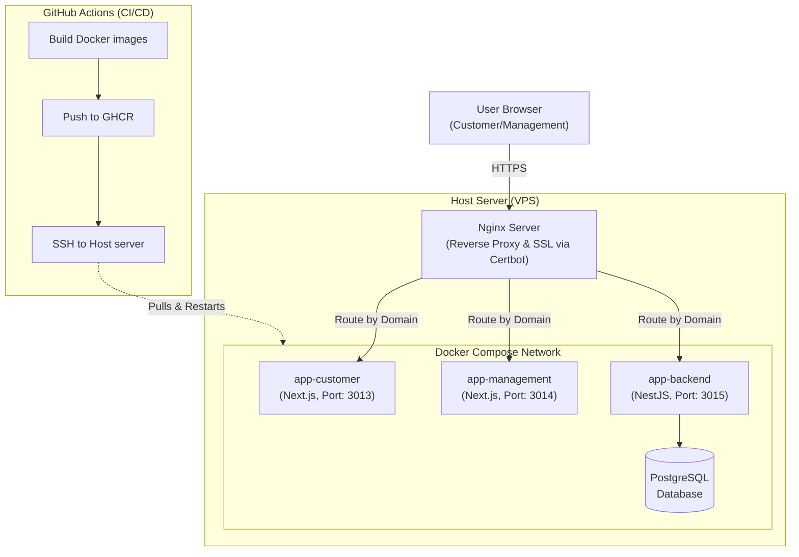

# Easy Fashion Limited

## Project Overview and Purpose

Easy Fashion Limited is a full-stack e-commerce platform designed for a fashion retail business. It encompasses a customer-facing storefront for browsing and purchasing products, a management dashboard for administrators to manage inventory, orders, and users, and a robust backend API powering both applications. Built with a modern technology stack (Next.js, NestJS, PostgreSQL), the platform provides a responsive, scalable, and seamless shopping experience.

## Architecture Diagram



## Full Local Installation Steps

To set up the project locally for development, ensure you have Node.js, Docker, and `make` installed.

```bash
make install
make migrate
make seed
make dev
```

_Note: Before running `make dev`, ensure you have copied the `.env.example` files to `.env` in `app-backend`, `app-customer`, and `app-management` and filled in the required values._

## Docker-Based Local Start

To run the entire stack (Database, Backend, Customer App, Management App) locally using Docker:

```bash
make up
```

## Production Deployment

The production deployment process is fully automated via GitHub Actions:

- **CI/CD Flow**: On push to the `main` branch, a GitHub Actions workflow builds Docker images for `app-customer`, `app-management`, and `app-backend`. These images are tagged and pushed to the GitHub Container Registry (GHCR). A deployment job then connects to the production server via SSH, pulls the latest images from GHCR, and restarts the Docker containers using Docker Compose.
- **Nginx & Certbot**: The host server utilizes Nginx as a reverse proxy, routing incoming traffic from specific subdomains (e.g., `easy.kaiofficial.xyz`, `admin-easy.kaiofficial.xyz`, `api-easy.kaiofficial.xyz`) to the corresponding internal Docker container ports. SSL certificates are provisioned and automatically renewed using Certbot, ensuring all traffic is securely encrypted over HTTPS.

## Feature-to-SRS-Section Mapping

| Feature             | SRS Section | Description                                  |
| ------------------- | ----------- | -------------------------------------------- |
| User Authentication | Sec 2.1     | Registration, Login, JWT-based auth          |
| Product Browsing    | Sec 2.2     | Catalog, Categories, Search, Filters         |
| Shopping Cart       | Sec 2.3     | Add/Remove items, quantity updates           |
| Checkout & Orders   | Sec 2.4     | Address input, Payment (Mock), Order history |
| Admin Dashboard     | Sec 3.1     | Analytics, Sales overview                    |
| Product Management  | Sec 3.2     | CRUD operations for products and categories  |
| Order Management    | Sec 3.3     | View and update order statuses               |
| User Management     | Sec 3.4     | View users and manage roles                  |

## Bonus Features

- **Design System First Approach**: Implemented a scalable UI using an atomic design hierarchy (Tokens → Atoms → Molecules → Organisms → Pages).
- **Automated Code Formatting**: Enforced ESLint, Prettier, Husky, and Commitlint at the monorepo root.
- **Responsive & Accessible Components**: All UI primitives are fully accessible (keyboard-navigable, ARIA attributes) and responsive out of the box.
- **Micro-Animations**: Enhanced user experience with subtle animations across components like buttons, modals, and toasts.

## Assumptions & Limitations

- **Payments**: The checkout process uses a mocked payment gateway. Real payment integration (e.g., Stripe) is required for actual production transactions.
- **Email Notifications**: Real email delivery for registration or order success is currently disabled/mocked.
- **Image Hosting**: Product images are uploaded to Cloudinary, assuming a valid Cloudinary API configuration.

## Security Notice

**Explicitly stated:** All production secrets live only in GitHub Actions repo secrets and the server's `.env` files — **never in git history**.
