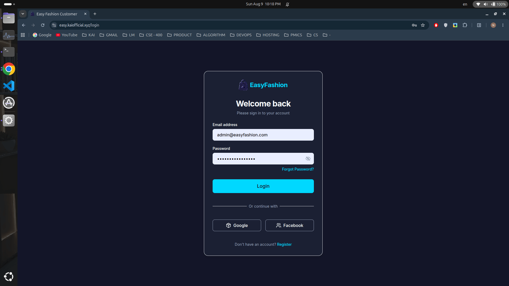
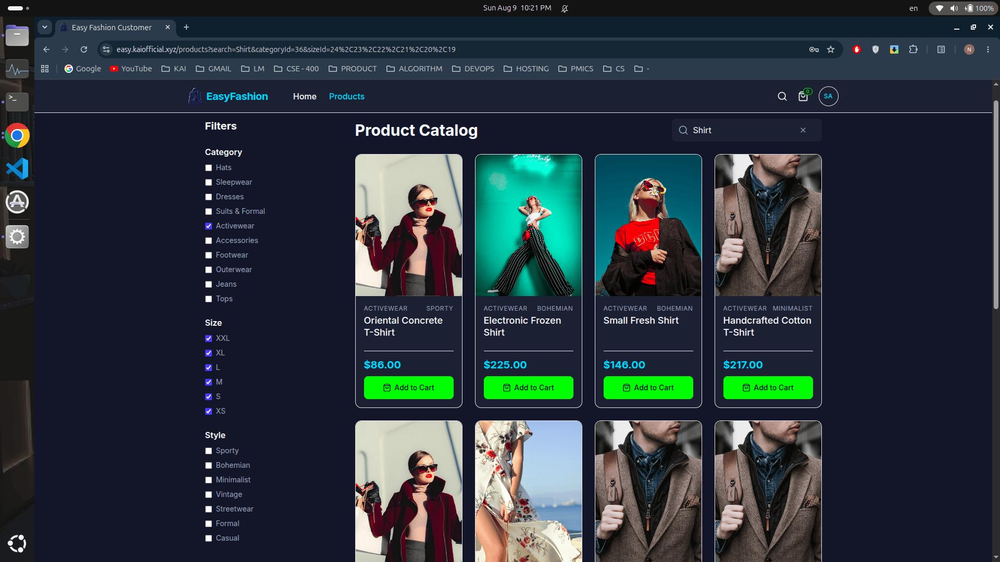
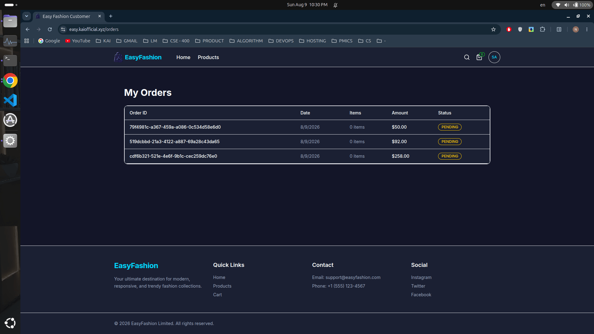
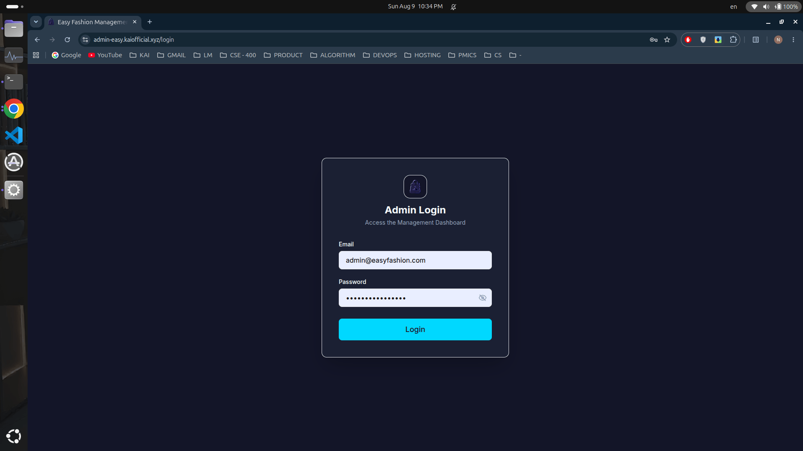
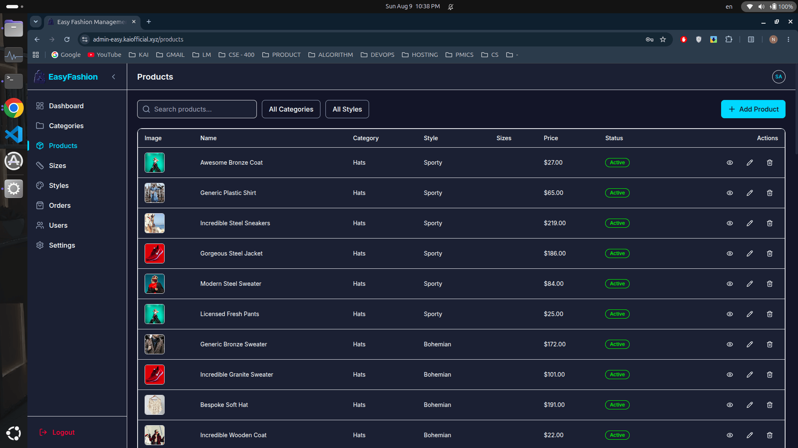
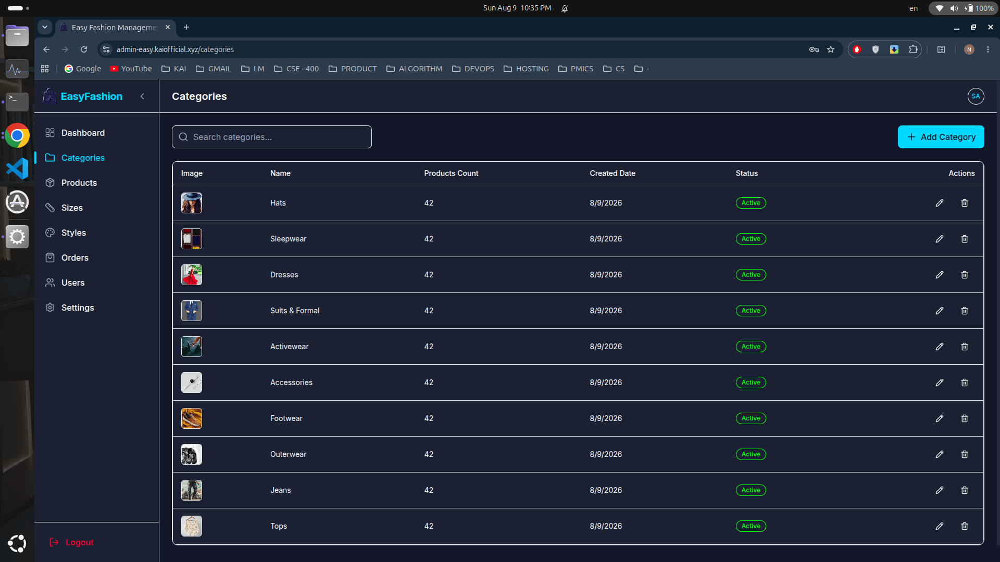
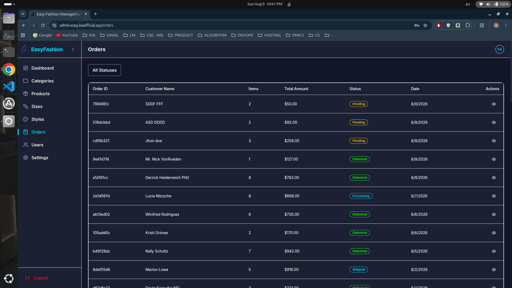
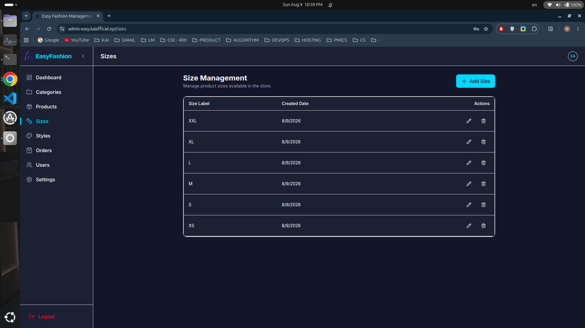
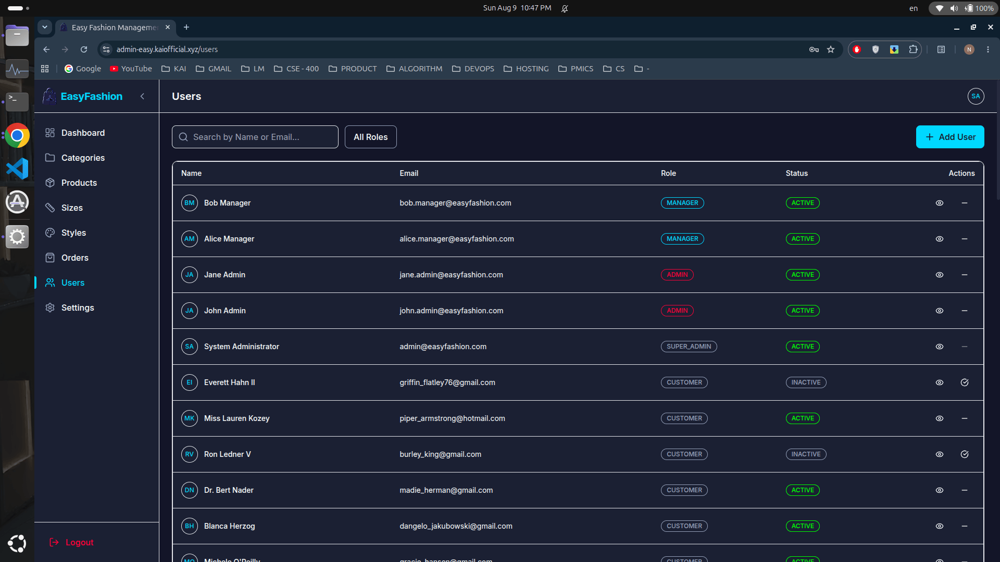
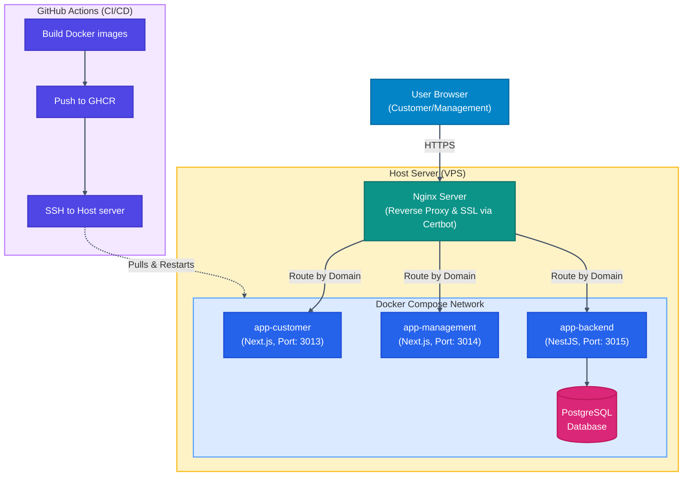

# Easy Fashion Limited

<p align="center">
  
</p>

## Project Overview and Purpose

Easy Fashion Limited is a full-stack e-commerce platform designed for a fashion retail business. It encompasses a customer-facing storefront for browsing and purchasing products, a management dashboard for administrators to manage inventory, orders, and users, and a robust backend API powering both applications. Built with a modern technology stack (Next.js, NestJS, PostgreSQL), the platform provides a responsive, scalable, and seamless shopping experience.

## 📸 Application Previews

### Customer Storefront

|                  Customer Home Page                  |                 Product Catalog & Filters                  |                 Profile & Order List                 |
| :--------------------------------------------------: | :--------------------------------------------------------: | :--------------------------------------------------: |
|  |  |  |

### Management Dashboard

|                     Sales Analytics                      |                    Product Management                     |                     Category Management                     |
| :------------------------------------------------------: | :-------------------------------------------------------: | :---------------------------------------------------------: |
|  |  |  |

|                   Order Management                    |                        Sizes & Styles                         |                   User Management                   |
| :---------------------------------------------------: | :-----------------------------------------------------------: | :-------------------------------------------------: |
|  |  |  |

## Architecture Diagram



## Setup & Installation

Before starting, copy the root `.env.example` file to `.env` in the project root, and copy the `.env.example` files to `.env` in each sub-app folder (`app-backend`, `app-customer`, and `app-management`), then configure the variables accordingly.

### 🐳 Option A: Docker (Containerized)

This option runs the entire stack (Database, Backend API, Customer Storefront, and Management Dashboard) inside Docker containers. Recommended for a quick start.

#### 1. Build the Docker images

```bash
make build
```

#### 2. Spin up the containers

```bash
make up
```

#### 3. Initialize & Seed the Database

```bash
make db-setup
```

This runs all database migrations and seeds initial database records (roles, users, products, categories, styles, sizes, etc.).

To stop the containers, run `make down`. To wipe database volumes and start fresh, run `make db-destroy`.

---

### 💻 Option B: Local (Node.js)

This option runs PostgreSQL in Docker but launches the NestJS backend and Next.js frontend servers locally on your machine. Best for active development.

#### 1. Install dependencies across all apps

```bash
make install
```

#### 2. Start PostgreSQL & local development servers

```bash
make dev
```

This command starts the PostgreSQL container, waits for the database to become healthy, and then concurrently boots the NestJS dev server and both Next.js dev servers on your machine.

#### 3. Run database migrations & seed

In a new terminal window, run:

```bash
make db-setup
```

---

### 🔗 Local Access Ports

Once the services are started (via either Option A or Option B), they can be accessed at:

- **Customer Storefront**: [http://localhost:3013](http://localhost:3013)
- **Management Dashboard**: [http://localhost:3014](http://localhost:3014)
- **Backend API**: [http://localhost:3015](http://localhost:3015)

---

### 🌐 Production Live Links

The production services are deployed and accessible at:

- **Customer Storefront**: [https://easy.kaiofficial.xyz](https://easy.kaiofficial.xyz)
- **Management Dashboard**: [https://admin-easy.kaiofficial.xyz](https://admin-easy.kaiofficial.xyz)
- **Backend API**: [https://api-easy.kaiofficial.xyz](https://api-easy.kaiofficial.xyz)

---

### 🔑 Default Admin Credentials

To log into the Management Dashboard, use the following seeded super admin credentials:

- **Email**: `admin@easyfashion.com`
- **Password**: `zGJLRyB6/pNWpxCA`

---

### ⚙️ Utility Commands

- **`make test`**: Runs the full test suite (unit + E2E).
- **`make lint`** / **`make lint-fix`**: Scans and auto-fixes linting errors.
- **`make format`**: Automatically formats code with Prettier.
- **`make typecheck`**: Runs TypeScript type check checks across the project.
- **`make db-destroy`**: Stops local containers and wipes database volumes.
- **`make down`**: Stops local development containers and frees up ports.

## Production Deployment

The production deployment process is fully automated via GitHub Actions:

- **CI/CD Flow**: On push to the `main` branch, a GitHub Actions workflow builds Docker images for `app-customer`, `app-management`, and `app-backend`. These images are tagged and pushed to the GitHub Container Registry (GHCR). A deployment job then connects to the production server via SSH, pulls the latest images from GHCR, and restarts the Docker containers using Docker Compose.
- **Nginx & Certbot**: The host server utilizes Nginx as a reverse proxy, routing incoming traffic from specific subdomains (e.g., `easy.kaiofficial.xyz`, `admin-easy.kaiofficial.xyz`, `api-easy.kaiofficial.xyz`) to the corresponding internal Docker container ports. SSL certificates are provisioned and automatically renewed using Certbot, ensuring all traffic is securely encrypted over HTTPS.

## Feature-to-SRS-Section Mapping

| Feature             | SRS Section | Description                                  |
| ------------------- | ----------- | -------------------------------------------- |
| User Authentication | Sec 2.1     | Registration, Login, JWT-based auth          |
| Product Browsing    | Sec 2.2     | Catalog, Categories, Search, Filters         |
| Shopping Cart       | Sec 2.3     | Add/Remove items, quantity updates           |
| Checkout & Orders   | Sec 2.4     | Address input, Payment (Mock), Order history |
| Admin Dashboard     | Sec 3.1     | Analytics, Sales overview                    |
| Product Management  | Sec 3.2     | CRUD operations for products and categories  |
| Order Management    | Sec 3.3     | View and update order statuses               |
| User Management     | Sec 3.4     | View users and manage roles                  |

## Bonus Features

- **Design System First Approach**: Implemented a scalable UI using an atomic design hierarchy (Tokens → Atoms → Molecules → Organisms → Pages).
- **Automated Code Formatting**: Enforced ESLint, Prettier, Husky, and Commitlint at the monorepo root.
- **Responsive & Accessible Components**: All UI primitives are fully accessible (keyboard-navigable, ARIA attributes) and responsive out of the box.

## Assumptions & Limitations

- **Payments**: The checkout process uses a mocked payment gateway. Real payment integration (e.g., Stripe) is required for actual production transactions.
- **Email Notifications**: Real email delivery for registration or order success is currently disabled/mocked.
- **Image Hosting**: Product images are uploaded to Cloudinary, assuming a valid Cloudinary API configuration.

## Security Notice

**Explicitly stated:** All production secrets live only in GitHub Actions repo secrets and the server's `.env` files — **never in git history**.
